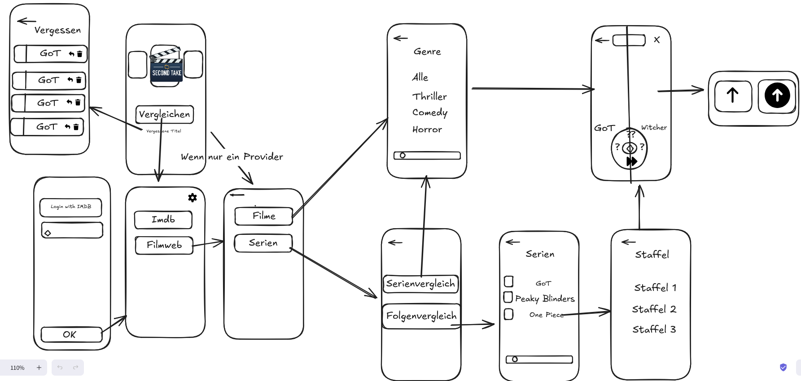
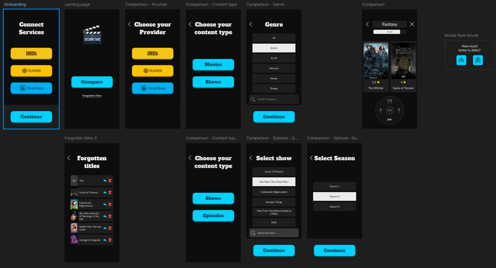

# SecondTake
Rewind your personal film and tv series rankings using pairwise comparisons

## Project Vision
Over time, personal film and tv series rankings and ratings tend to lose their meaning.
Titles watched years ago were often rated in a different context, 
with different expectations, taste, and emotional background. 
As a result, many rankings become inconsistent, inflated, or simply outdated.

This project aims to help users re-evaluate and organize previously watched titles by focusing on direct comparison rather than absolute scoring.
Comparing two similar titles at a time allows for more precise judgment and helps naturally rebalance ratings across the entire library.

## Setup
This Setup guide is for IntelliJ Idea.

1. After opening IntelliJ Idea, click on **Projects** on the left menu and then **Clone Repository** on the right side.
2. Now in the left menu, choose **Repository URL**. For the version control you want to use **Git**. In the **URL** input field, paste the Repository URL of this project and choose the directory where you want to save this project. Lastly, click on **Clone**.
3. When the IDE finished cloning the project, it opens the editor window. In the project file tree, navigate to `app -> composeApp` and open `build.gradle.kts`.
4. At the top of the code window, you should see a warning saying "Code insight unavailable (related Gradle project not linked)." In this alert bar, click **Link Gradle project**.
5. In the explorer window, select `build.gradle.kts` in the app folder. The IDE should now start the sync process. Note that you have to use **Java 24**; If you don't, the IDE will ask you to change it.
6. After the Sync finished, you can click on the Gradle icon in the right sidebar. In the Gradle menu, click on `Tasks -> kotlin browser -> wasmJsBrowserDevelopmentRun`. The App will now start. The first start will take some minutes, afterwards it will start faster. Also, after a gradle configuration has been started for the first time, it's possible to start it easier by selecting the config and pressing **Play** at the top of the IDE.

## Requirements
| ID  | Priority | Title                                           | User Story                                                                                                                                   | Acceptance Criteria                                                                                                                                                                                                                                                                                                                                                                                                                                                                                                                                        |
|-----|----------|-------------------------------------------------|----------------------------------------------------------------------------------------------------------------------------------------------|------------------------------------------------------------------------------------------------------------------------------------------------------------------------------------------------------------------------------------------------------------------------------------------------------------------------------------------------------------------------------------------------------------------------------------------------------------------------------------------------------------------------------------------------------------|
| R01 | 1        | Compare two titles                              | As a user, I want to compare two titles and choose the one I prefer, so that I can express my preference between them.                       | 1. Both titles have to be of the same type (tv series, film etc.) 
 2. Both titles have to be of the same genre 
 3. Both titles must have similar rating (max. difference of one point)   **Rules:**   - Same ratings: Worse title rating should be reduced by one point   - Picked title has worse rating: Worse title rating should be reduced by two points   - Picked title has better rating: Reduce worse title by one point 
 4. Only titles that were rated at least six months prior are eligible for re-evaluation. |
| R21 | 1        | Compare multiple pairs of titles in one session | As a user, I want to have a comparison session with multiple pair of titles at once, so that I can soft my library faster.                   |                                                                                                                                                                                                                                                                                                                                                                                                                                                                                                                                                            |
| R02 | 2        | Skip comparison                                 | As a user, I want to skip the current comparison without making a choice, so that I am not forced to decide when I'm unsure.                 |                                                                                                                                                                                                                                                                                                                                                                                                                                                                                                                                                            |
| R10 | 2        | Requeue skipped titles                          | As a user, I want the skipped titles to be requeued, so that I can compare them.                                                             | 1. Skipped title should be compared against a different one                                                                                                                                                                                                                                                                                                                                                                                                                                                                                                |
| R11 | 2        | Requeue skipped comparisons                     | As a user, I want both titles in a skipped comarison to be requeued, so that I can compare them.                                             | 1. Both requeued titles should be compared against two different matches                                                                                                                                                                                                                                                                                                                                                                                                                                                                                   |
| R18 | 2        | Define the superiority of the chosen title      | As a user, I want to be able to express during a comparison how much I prefere one title over the other                                      | 1. The winner title rating points should be increased based on the level of superiority: LOW = 0, MEDIUM = 1, HIGH = 2                                                                                                                                                                                                                                                                                                                                                                                                                                     |
| R05 | 2        | Start session by genre                          | As a user, I want to start a new comparing session by genre, so that I only compare titles from a genre I'm interested in.                   |                                                                                                                                                                                                                                                                                                                                                                                                                                                                                                                                                            |
| R16 | 2        | Start session by show                           | As a user, I want to be able to compare two episodes of a show and choose the one I prefer, so that I can express my preference between them. | 1. After the session ends the total rating for the show should get updated                                                                                                                                                                                                                                                                                                                                                                                                                                                                                 |
| R03 | 3        | Mark title as forgotten                         | As a user, I want to mark one of the compared titles as forgotten, so that it won't appear in further sessions.                              |                                                                                                                                                                                                                                                                                                                                                                                                                                                                                                                                                            |
| R04 | 3        | Mark comparison as forgotten                    | As a user, I want to mark both compared titles as forgotten, so that neither of them appears in further sessions.                            |                                                                                                                                                                                                                                                                                                                                                                                                                                                                                                                                                            |
| R12 | 3        | Remove newly rated titles from forgotten list   | As a user, I want forgotten-titles which i rated again to be automatically removed from the forgotten list.                                  |                                                                                                                                                                                                                                                                                                                                                                                                                                                                                                                                                            |
| R07 | 3        | View forgotten titles                           | As a user, I want to view forgotten titles, so that I can see which titles to rewatch.                                                       |                                                                                                                                                                                                                                                                                                                                                                                                                                                                                                                                                            |
| R09 | 3        | Queue forgotten title to rewatch                | As a user, I want to add a forgotten title to a rewatch queue, so that I can plan future rewatches.                                          |                                                                                                                                                                                                                                                                                                                                                                                                                                                                                                                                                            |
| R08 | 3        | Delete forgotten titles                         | As a user, I want to delete titles from the forgotten list, in case I don't intend to rewatch it                                             |                                                                                                                                                                                                                                                                                                                                                                                                                                                                                                                                                            |
| R14 | 3        | Go to back to previous comparison               | As a user, I want to be able to go back to the previous comparison in order to change my decision.                                           |                                                                                                                                                                                                                                                                                                                                                                                                                                                                                                                                                            |
| R20 | 3        | Link Onlyfilms-Account                          | As a user, I want to be able to link my Onlyfilms-Account, so that I can re-evaluate my rated titles                                         |                                                                                                                                                                                                                                                                                                                                                                                                                                                                                                                                                            |
| R13 | 3        | Unlink Account                                  | As a user, I want to be able to unlink my provider account.                                                                                  |                                                                                                                                                                                                                                                                                                                                                                                                                                                                                                                                                            |
| R17 | 3        | Rate indivitual episodes of a show              | As a user, I want to be able to rate every episode of a show based on a existing rating of the show                                          | 1. After the session ends the total rating for the show should get updated
2. This should only be possible if no episodes of a show were rated                                                                                                                                                                                                                                                                                                                                                                                                        |
| R06 | 4        | Start session by franchise                      | As a user, I want to start a new comparing session by franchise, so that I can easier rank titles within a franchise.                        |                                                                                                                                                                                                                                                                                                                                                                                                                                                                                                                                                            |
| R15 | 5        | Link IMDB-Account*                              | As a user, I want to be able to link my IMDB-Account, so that I can re-evaluate my rated titles                                              |                                                                                                                                                                                                                                                                                                                                                                                                                                                                                                                                                            |
| R19 | 5        | Link Filmweb-Account*                           | As a user, I want to be able to link my Filmweb-Account, so that I can re-evaluate my rated titles                                           |                                                                                                                                                                                                                                                                                                                                                                                                                                                                                                                                                            |

\* Neither IMDb nor Filmweb provide public authentication mechanisms or officially supported API access for third-party applications to operate on its user data.

## Implemented features
All features have been successfully implemented except for the following:

### Partly implemented features
+ Start session by show
+ Link Onlyfilms-Account
+ Rate individual episodes of a show

### Missing features
+ Start session by franchise
+ Queue forgotten titles to rewatch
+ Go back to previous comparison
+ Unlink Account
+ Link IMDB-Account*
+ Link Filmweb-Account*

\* See the disclaimer below the requirements table.

## Integration with Onlyfilms
Onlyfilms is a film rating platform and was programmed for another module in previous semester 
for the IU International University of Applied Sciences. 

Since the integration with IMDb or Filmweb was proven to be more complex than initially
thought and would require reverse engineering or paying for their api, another thought emerged: Why not integrate
a previous project?

Onlyfilms already had a authentication system implemented, though there is no way to connect an Onlyfilms account
with any third party app yet.

Since this integration required extra steps to be taken, [a patch file](patches/onlyfilms-oauth.patch) has also
been commited to illustrate the changes made to the Onlyfilms project in order to support the necessary Oauth2 Flow.

Though Onlyfilms isn't integrated in this app yet, SecondTake's backend is prepared for a future integration.

## Wireframe and Prototype
In the planing process of the app, we created a [Wireframe](https://excalidraw.com/#room=c25dc0e4c29782d508ab,vnMPNPXtShImigB_j-deHA) and a [Prototype](https://www.figma.com/design/QjbKN4ucVCR4rfIJRmnsR9/Prototyp?node-id=0-1&t=ujRSXogoxr9GDKU6-1).

### Wireframe

### Prototype

## Data Layer with KStore
[KStore](https://github.com/xxfast/KStore) is a tiny asynchronous Kotlin multiplatform library, which helps with saving and retrieving data
from different places based on the platform it implemented on.

Since this project was meant to be targeting Web (wasm/js) primarily the `kstore-storage` package
helped with (de)serialising JSON and saving the domain objects into `LocalStorage`. 
Since Wasm support for Kotlin Multiplatform is relatively new, KStore saved some of the implementation time,
which would be necessery to implement the functionality in the Browser API directly.